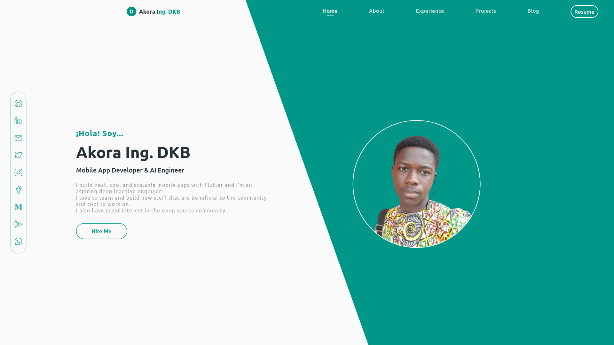

# My Portfolio Website - Source Code

Source code for my [portfolio website](https://akora-ingdkb.me) built with [Flutter](https://flutter.dev).



## Steps to Reproduce
1. Locate the source code at `./lib/` and edit per your choice.

2. The website is hosted with [Github Page](https://pages.github.com/) with the local repository located at `../../Akora-IngDKB.github.io` (two directories above the working directory).  
It is deployed with the `./deploy.sh` script.  
Make the following changes to suit your directory structure:
```bash
# Copy the generated files into the Github pages repo directory
Line 24: cp -R build/web/. <your-local-ghpages-repo-dir-path>

# Change into the Github pages repo directory, commit the changes and push
Line 29: cd <your-local-ghpages-repo-dir-path>
```

3. Finally, run `./deploy.sh` in a terminal with the root directory to deploy.  
Alternatively, you can add an optional commit message (defaults to "Update") which will be used for committing in the gh-pages repo like so:
```bash
./deploy.sh "My portfolio rework"
```